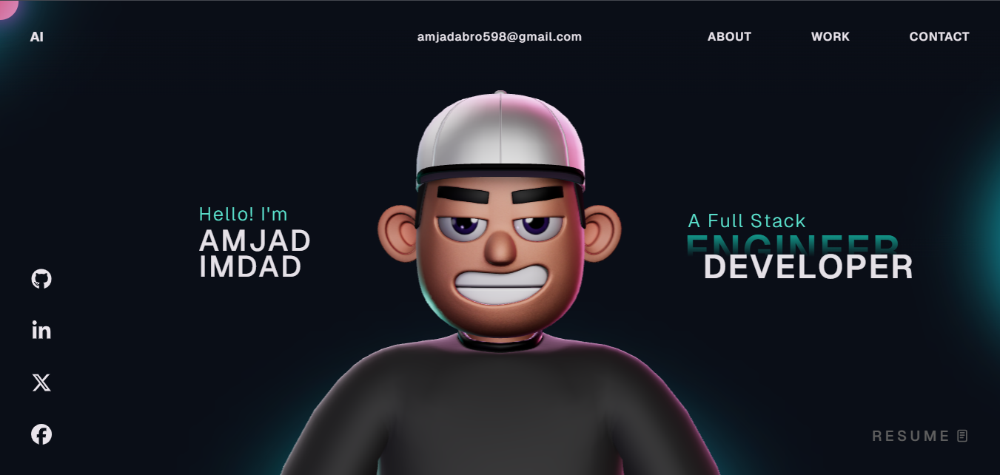

# 🌌 Animated Developer Portfolio

An immersive and fully animated developer portfolio built with modern web technologies.  
Crafted to deliver a smooth, interactive, and visually engaging experience with cinematic animations, 3D scenes, and fluid transitions.

---

## ✨ Features

- 🎨 Modern animated UI/UX
- 🌌 Interactive 3D scenes with Three.js
- ⚡ Smooth page transitions and scroll animations
- 🎭 GSAP powered motion effects
- 📱 Fully responsive design
- 🌙 Dark themed aesthetic
- 🚀 Optimized performance
- 🧩 Component-based architecture
- 🎯 Clean and scalable architecture

---

## 🌍 Live Demo

https://animatedportfolio.vercel.app

---

## 🛠️ Tech Stack

### Frontend

- Typescript
- React.js
- Vite

### Animation & 3D

- Three.js
- GSAP

### Styling

- CSS3
- Tailwind CSS

### Tools

- Git
- GitHub
- Vercel

---

## 📸 Preview



---

## 🚀 Getting Started

### Clone the repository

```bash
git clone https://github.com/amjadimdad00/AnimatedPortfolio.git
```

### Navigate into the project

```bash
cd AnimatedPortfolio
```

### Install dependencies

```bash
npm install
```

### Start development server

```bash
npm run dev
```

---

## 📁 Project Structure

```bash
src/
├── assets/
├── components/
├── context/
├── data/
├── App.tsx
├── App.css
├── index.css
└── main.tsx
```

## 🎬 Animations Used

- Scroll-triggered animations
- Parallax effects
- 3D camera motion
- Smooth entrance transitions
- Hover interactions
- Floating object animations
- Timeline-based GSAP sequences

---

## 🌐 Deployment

Deployed on Vercel.

```bash
npm run build
```

---

## 📌 Future Improvements

- Add blog section
- Add multilingual support
- Improve accessibility
- Add CMS integration
- Add project filtering

---

## 🤝 Contributing

Contributions, suggestions, and feedback are welcome.

Feel free to fork the project and open a pull request.

---

## 📄 License

This project is licensed under the MIT License.

<p align="center"> Made with 💖 by <a href="https://linkedin.com/in/amjadimdad" target="_blank"><b>Amjad Imdad</b></a><br> ✨ Star this repo if you found it useful! ✨<br> <sub>Contributions, feedback & PRs are always welcome 🚀</sub> </p>
